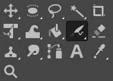
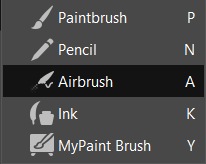
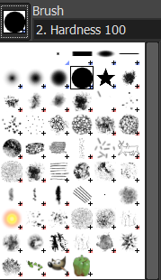
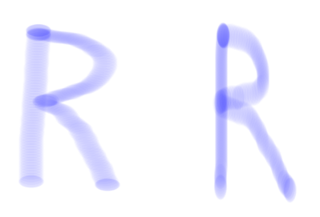
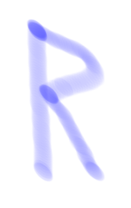
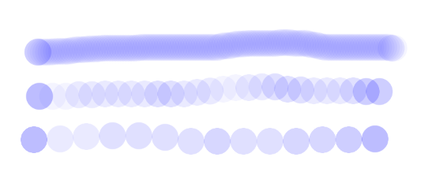
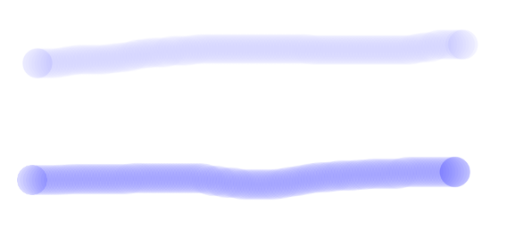
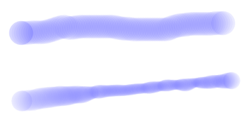

#  *Airbrush Tool*

*Written by Samuel Bjorkman*

## Overview

The  *Airbrush Tool* is a paint tool that paints with varying intensity depending on how long it is held down for. Generally speaking, it is most useful in situations that require soft transitions between colors.

## Select the  *Airbrush Tool*

The *Airbrush Tool* may be activated by simply pressing `A`. It can also be accessed from the toolbox by left-clicking the airbrush icon.

If the airbrush icon is not displayed in the toolbox, then a tool in the same family will be. Below are the tools in the same tool family as *Airbrush Tool*. Select the  *Airbrush Tool* or press `A`.

## Basic Usage

Click and hold to paint with the *Airbrush Tool*. Moving slower will result in thicker lines and darker shading, while moving faster will result in thinner lines and lighter shading.

Below, the image on the left shows a line drawn slowly with the  *Airbrush Tool*, while the image on the right shows a similar line drawn quickly.

| Slowly drawn | Quickly drawn |
|:---:|:---:|
|  |  |

## Tool Options

The tool options for the  *Airbrush Tool* allow you to change the functionality of the tool in useful ways. The tool options dialogue can be accessed by navigating to `Windows` > `Dockable Dialogues` > `Tool Options`. 

## Opacity

The first option in the tool options dialogue for the  *Airbrush Tool* is a slider labeled `Opacity`. Adjusting it changes the maximum intensity of a stroke made with the  *Airbrush Tool*. An opacity of 100 will allow you to completely cover the background you're painting over, while an opacity of 0 will produce completely invisible strokes. Anything in between will result in strokes that are partially transparent.

  *The dot on the left was made with an opacity of 100, while the dot on the right was made with an opacity of 50.*

## Brushes

The second option in the tool options dialogue for the  *Airbrush Tool* is labeled brushes. There will be an icon with the brush currently selected. Clicking this icon reveals all the brushes that can be used with the  *Airbrush Tool*. Changing the brush will change the shape of strokes created using the tool. There are dozens of different brush presets, so you are encouraged to try for yourself which one will work best for what you're trying to do.

## Size 

In the tool options dialogue for the  *Airbrush Tool*, there is a slider labeled `Size`. Changing the size changes the radius of the brush you're using, measured in pixels.

## Aspect Ratio and Angle

In the tool options dialogue, there is a slider labeled `Aspect ratio`, and one below it labeled `Angle`. The aspect ratio changes the ratio of the width and height of the brush. An aspect ratio greater than 0 will result in a brush that is longer horizontally, while a ratio less than 0 will result in a brush that is longer vertically.

  *The left 'R' is drawn with an aspect ratio of 1.00, while on the right 'R' is drawn with an aspect ratio of -1.00.*

Changing `Angle` rotates the brush, allowing you to create brushes that are longer along some dimension other than up-down or left-right. The angle is measured in degrees, with 0 degrees being up, and positive angles rotating the brush clockwise.

  *This 'R' was drawn with an angle of 45 degrees.*

## Spacing

In the tool options dialogue for the  *Airbrush Tool*, there is a slider labeled `Spacing`. This changes the distance between each instance of the brush shape that is drawn when you make a stroke. A lower spacing will result in a smoother stroke, while a higher spacing will result in a stroke that looks like a series of dots. For example:

  *The top line is drawn with a spacing of 10, the middle line is has a spacing of 50, and the bottom line has a spacing of 100*

## Hardness

In the tool options dialogue, there is a slider labeled `Hardness`. A hardness of 100 will result in strokes the exact same shape as the brush being used, producing strokes with hard edges. A hardness any less than 100 will feather the edges of the brush, producing strokes with softer edges.

  *The dot on the left has a hardness of 100. The dot on the right has a hardness of 50.*

## Force

In the tool options dialogue, there is a slider labeled `Force`. Changing it will change how fast the tool will fill in strokes.

  *The line on the top has a force of 20. The line on the bottom is drawn at about the same speed, but with force set to 100.*

## Dynamics

In the tool options dialogue, there is a section called `Dynamics`. This allows you to change functionality of the brush depending on the speed at which you paint. To the left, there is a menu with several presets for dynamics. To the right, there is text field displaying the current dynamics preset, from which you can also search for dynamics presets. Below this, there are settings for dynamics that you can manually adjust.

  *The top line is drawn using a brush with no dynamics. The bottom line is drawn with the `Basic Dynamics` preset applied. Notice the portion of the line that became thinner. This is because it was drawn more quickly.*

Using Dynamics on a paintbrush can allow you to simulate different ways of a real paintbrushes interact with a canvas, which may be useful in creating certain effects.