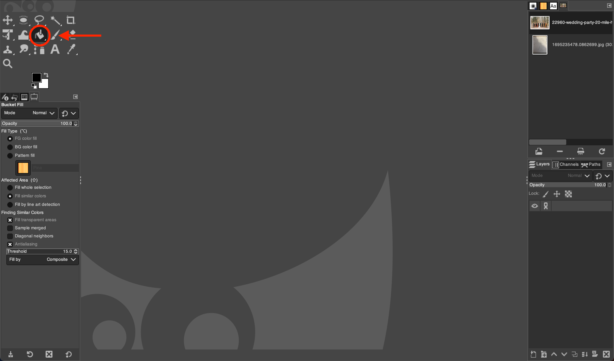
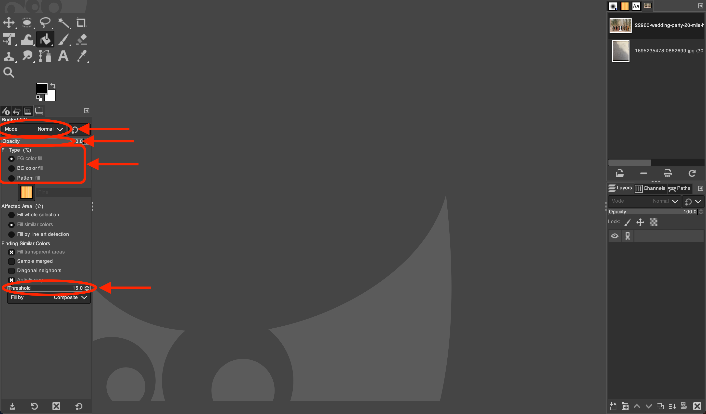

# Using the Bucket Fill Tool in GIMP

*Written by Andrew Stevenson*

## 1. Open GIMP and Your Image:

1. Go to the `File` menu and select `Open` (Or press `Ctrl` + `O` for Windows and ⌘ `Cmd` + `O` for Mac). 
2. On the pop-up menu, navigate to your file by clicking on one of the folders on the left or by using the **Location** search bar.
    > $\color{lightgreen} \text{Tip:}$ If you want to add a folder to the bar on the left for easy access, first navigate to it using the **Location** search bar. Then click on the `+` in the bottom left, and the name of the folder you've selected will show up at the bottom.

## 2. Select the Bucket Fill Tool:

Click on the  *Bucket Fill Tool* icon outlined below or press `Shift` + `B`.

## 3. Adjust the Bucket Fill Settings:

In the Tool Options panel, you can adjust several settings:
- **Fill Type:** Choose between `Foreground Color fill`, `Background Color fill`, and `Pattern fill`.
- **Mode:** Select the blending mode for the fill.
- **Opacity:** Set the opacity level of the fill.
- **Threshold:** Determine the range of similar colors the bucket will fill.

## 4. Use the  *Bucket Fill Tool*:

To fill an entire image, click anywhere. Make sure you have nothing selected.

To fill a portion of an image, you need to select it. See some of our guides on how to make selections using [Selection Tools](../Selection%20Tools/).

## 5. Finalize Your Edits:

- Once you're satisfied with the fill, you can make further edits or enhancements with other GIMP tools.
- Save your changes by going to `File` > `Export As`, and choose your preferred file format and location.

# Tips for the Bucket Fill Tool:

- To quickly switch between the foreground and background fill, press `X` or click the  `Exchange foreground and background colors` icon below the Toolbox.
- If the fill isn't applying as expected, adjust the `Threshold` or check if you have the correct layer selected.
- For a non-destructive workflow, use the Bucket Fill Tool on a new layer and adjust the blending modes for different effects.
- Remember to undo (`Ctrl` + `Z` on Windows or ⌘`Cmd` + `Z` for Mac) if the fill goes wrong and try adjusting the settings before applying it again.