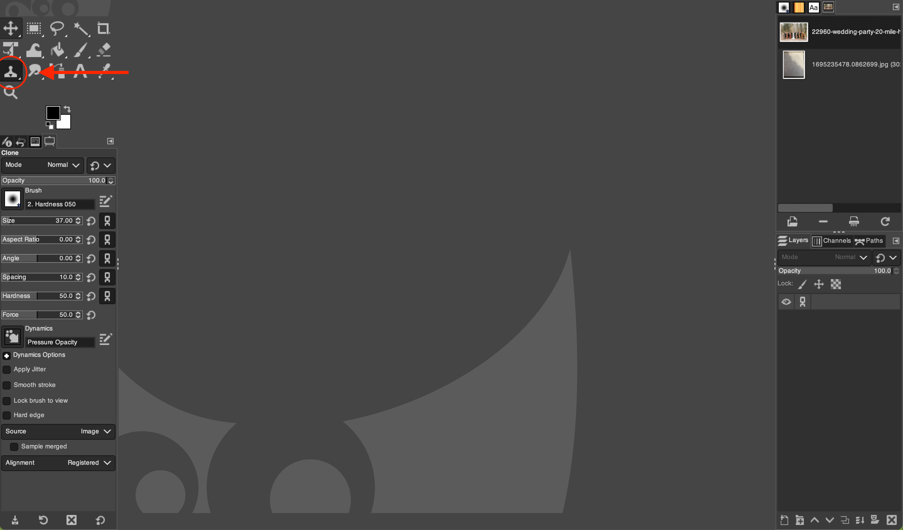
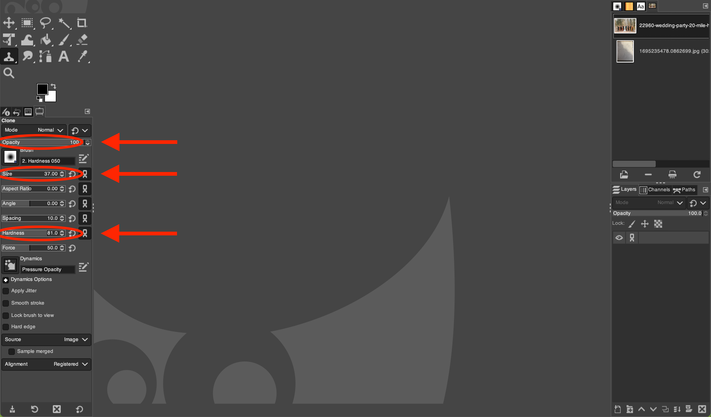
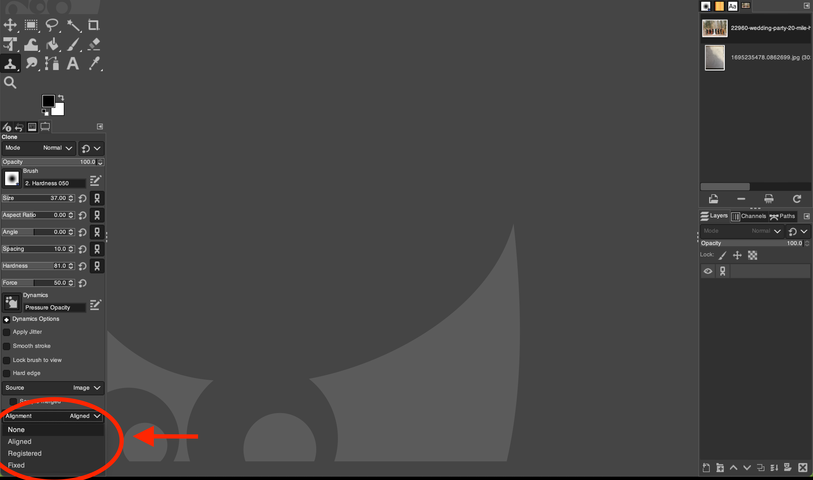

# Using the Clone Tool in GIMP

*Written by Andrew Stevenson*

## 1. Open GIMP and Your Image

1. Go to the `File` menu and select `Open` (Or press `Ctrl` + `O` for Windows and ⌘ `Cmd` + `O` for Mac). 
2. On the pop-up menu, navigate to your file by clicking on one of the folders on the left or by using the **Location** search bar.
    > $\color{lightgreen} \text{Tip:}$ If you want to add a folder to the bar on the left for easy access, first navigate to it using the **Location** search bar. Then click on the `+` in the bottom left, and the name of the folder you've selected will show up at the bottom.

## 2. Select the  *Clone Tool*

Click on the  *Clone Tool* icon outlined below or press `C`.

## 3. Adjust Tool Settings

In the Tool Options panel, you can adjust several settings:
- **Size:** Adjusts the diameter of the brush.
- **Hardness:** Adjusts the edge softness of the brush.
- **Opacity:** Adjusts the transparency of the cloned area.

## 4. (Optional) Adjust Alignment Mode

In the Tool Options panel, there are some different alignment modes to choose from:
- **None Mode:** Clones from the initial source point for each new brushstroke, with no relation to previous strokes.
- **Aligned Mode:** Maintains a consistent offset between source and destination across all brushstrokes after the first.
- **Registered Mode:** Clones from a source layer to a target layer, aligning each cloned pixel to its corresponding location in the source.
- **Fixed Mode:** Clones from a fixed source origin, repeating the same sample with each brushstroke regardless of brush movement.

## 5. Use the  *Clone Tool*

First, you need to set the clone source:
1. Move the cursor to the area of the image you want to use as a source for cloning.
2. Press and hold down `Ctrl` key for Windows (or ⌘`Cmd` for Mac) and click once. Note that the cursor changes shape,indicating you are in source mode.

Now, you can start to copy this clone to a different portion of the image:
1. Move the cursor to the area where you want to apply the clone.
2. Press and hold the left mouse button and start painting over the area you want to cover. As you paint, you'll notice that the source point also moves, indicating which part of the image it's 
sampling from.

# Tips

- Zoom in for more precision while cloning.
- Regularly change the source point to avoid repetitive patterns.
- For large areas, use a bigger brush size, but for detailed work, switch to a smaller brush.

