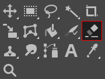
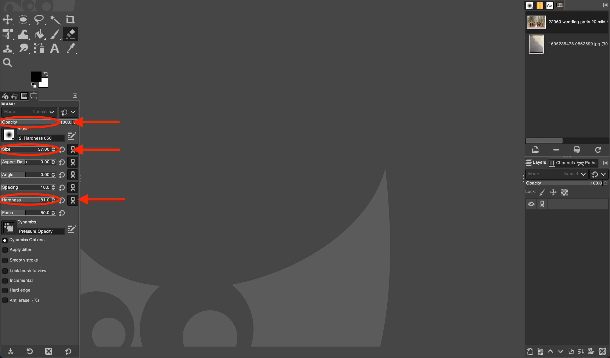

# Using the Eraser Tool in GIMP

*Written by Andrew Stevenson*

## 1. Open GIMP and Your Image:

1. Go to the `File` menu and select `Open` (Or press `Ctrl` + `O` for Windows and ⌘ `Cmd` + `O` for Mac). 
2. On the pop-up menu, navigate to your file by clicking on one of the folders on the left or by using the **Location** search bar.
    > $\color{lightgreen} \text{Tip:}$ If you want to add a folder to the bar on the left for easy access, first navigate to it using the **Location** search bar. Then click on the `+` in the bottom left, and the name of the folder you've selected will show up at the bottom.

## 2. Select the  *Eraser Tool*:

Click on the  *Eraser Tool* icon outlined below or press `Shift` + `E`.

## 3. Adjust Eraser Settings

In the Tool Options panel, you can adjust several settings: 
- **Opacity:** Controls how transparent the erased area will be.
- **Size:** Sets the diameter of the eraser.
- **Hardness:** Determines the softness of the eraser's edges.
- **Dynamics:** Modifies the eraser's effect based on pressure (when using a tablet), speed, and direction.
- **Hard Edge:** Switches between a feathered edge and a hard-edged eraser.

## 4. Use the  *Eraser Tool*

Click and hold the left mouse button, then drag to erase parts of the image. It's as simple as that!

# Tips

- **Zoom In**: Press `Ctrl` + `Scroll` with your mouse for Windows or ⌘ `Cmd` + `Scroll` on Mac to zoom in/out. This will help you select more accurately.
- Use the `Undo` action (`Ctrl`+`Z` for Windows or ⌘`Cmd` + `Z` for Mac) to correct any mistakes immediately.
    > $\color{lightblue} \text{Note:}$ This works better if you periodicially let go of your mouse mouse so correctly erased portions don't need to be re-erased.
- Work on a duplicate layer to ensure the original image remains unaltered. This allows you to erase without permanently removing parts of the original image. To create a new layer, go to `Layer` > `Duplicate Layer` or press `Shift` + `Ctrl` + `N` for Windows or `Shift` + ⌘`Cmd` + `N` for Mac.

