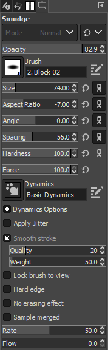

# Using the Smudge Tool in GIMP

*Written by Andrew Stevenson*

## 1. Open GIMP and Load Your Image

1. Go to the `File` menu and select `Open` (Or press `Ctrl` + `O` for Windows and ⌘ `Cmd` + `O` for Mac). 
2. On the pop-up menu, navigate to your file by clicking on one of the folders on the left or by using the **Location** search bar.
    > $\color{lightgreen} \text{Tip:}$ If you want to add a folder to the bar on the left for easy access, first navigate to it using the **Location** search bar. Then click on the `+` in the bottom left, and the name of the folder you've selected will show up at the bottom.

## 2. Select the  *Smudge Tool*

Click on the  *Smudge Tool* icon outlined below or press `S`.

## 3. Adjust Smudge Settings

In the Tool Options panel, you can adjust several settings:
  - **Size**: Adjusts the size of the smudge brush (in pixels).
  - **Aspect Ratio**: Adjusts the width and height of the smudge brush.
  - **Angle**: Adjusts the angle of the smudge brush.
  - **Spacing**: Adjusts the distance between each instance of smudging.
  - **Hardness**: Determines the edge hardness of the smudge brush.
  - **Force**: Controls the strength of the smudging effect.
  - **Rate**: Adjusts the speed at which the smudge effect is applied.
  - **Flow**: Controls how much color is applied as you move the brush.

## 4. Apply the Smudge Effect

1. Position the cursor over the area of the image you want to smudge.
2. Click and hold the left mouse button, then drag the cursor in the direction you wish to smudge.
3. The longer you drag, the more pronounced the smudge effect will be.

## 5. Experiment with Different Brushes

You can experiment with different brushes for varied smudge effects. Brushes with textured edges can create interesting patterns.

To change the brush, open the `Brush Dialog` shown below:

## 6. Adjust Smudge Settings

In the Tool Options panel, you can adjust several settings:
- **Rate:** Sets the intensity of the smudge effect.
- **Force:** Sets the flow of the smudge effect.
  > $\color{lightgreen} \text{Tip:}$ For subtle smudging, use a lower `Force` setting. For more dramatic effects, increase the `Force`.

## 7. Save 

- Once you are happy with the smudging, you can make any final adjustments or add additional effects using GIMP's vast array of tools and filters.
- To save your work, go to `File` > `Export As`, then select the desired file format and settings.

# Tips for Using the Smudge Tool

- For better control, zoom in on the area you're working on.
- Use a tablet with a stylus for a more natural and precise smudging experience.
- Adjust the size of the brush according to the detail level required: smaller brushes for fine details, larger ones for broad smudge strokes.
- Use the `Undo` action (`Ctrl`+`Z` for Windows or ⌘`Cmd` + `Z` for Mac) to correct any mistakes immediately.
- Combining the  *Smudge Tool* with different layer modes can create unique effects for your artwork.

