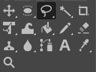
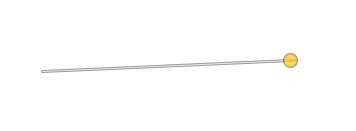
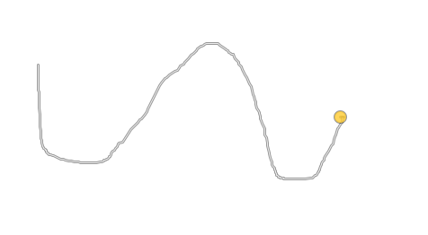
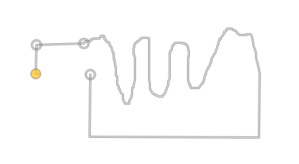
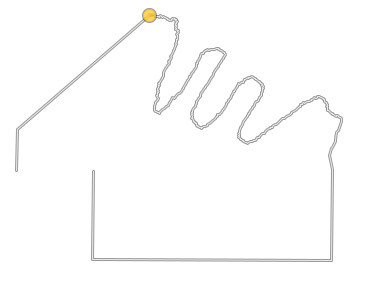
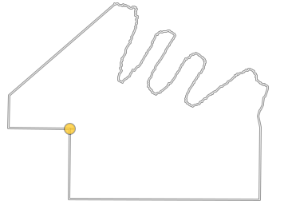

#Free Select Tool

##Overview

The free select tool is used to create selections of irregular shape. In GIMP, a selection is a bounded region that limits where certain tools can be applied. With the free select tool, selections can be formed by drawing an outline, or by placing points to form connected line segments, or by a combination of both. 

##Activating the Free Select Tool

The free select tool can be activated by pressing `F` on your keyboard, or by finding the toolbox and left-clicking the lasso icon.

If the tool bar is not in your window, it can be displayed by navigating to `Windows>Toolbox`, or by using `Ctrl+B`. 

##Basic Usage

To begin creating a selection, left-click anywhere on the canvas. Letting go of your left mouse button and clicking another point on the canvas will form a straight line segment.

 Holding down your left mouse button and dragging your cursor lets you draw a segment in any shape. 

 

You can keep placing points and drawing lines to form as many consecutive segments as needed. Both drawn and straight segments may be used within the same selection.

 

Notice that the points forming the edges of segments in the selection being drawn are marked with circles. While creating a selection, the position of any of these points can be moved by clicking and dragging the circle marking it. This will apply transformations to the end of any segments connected to the point.

To complete a selection, click on the point that you started the selection at, then press `F` or select a different tool.

The completed selection will be marked by a dotted line, in the shape of the path you created. As you can see, the selection specifies the area in which the effects of tools apply; for example the pencil tool as shown below:

##Tool Settings

