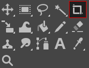
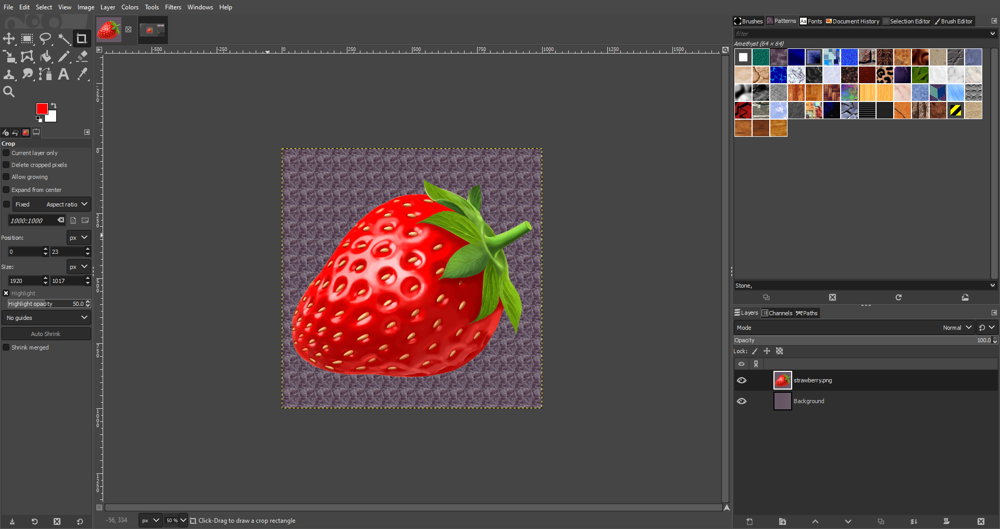
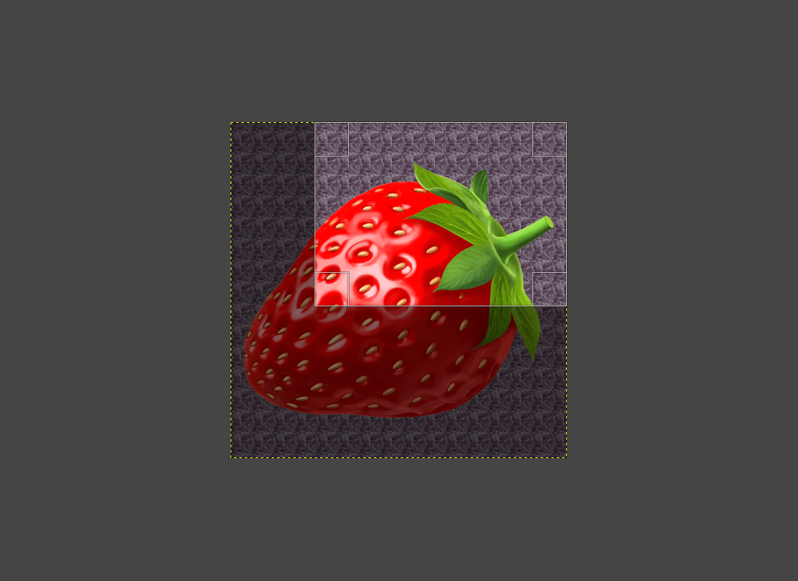
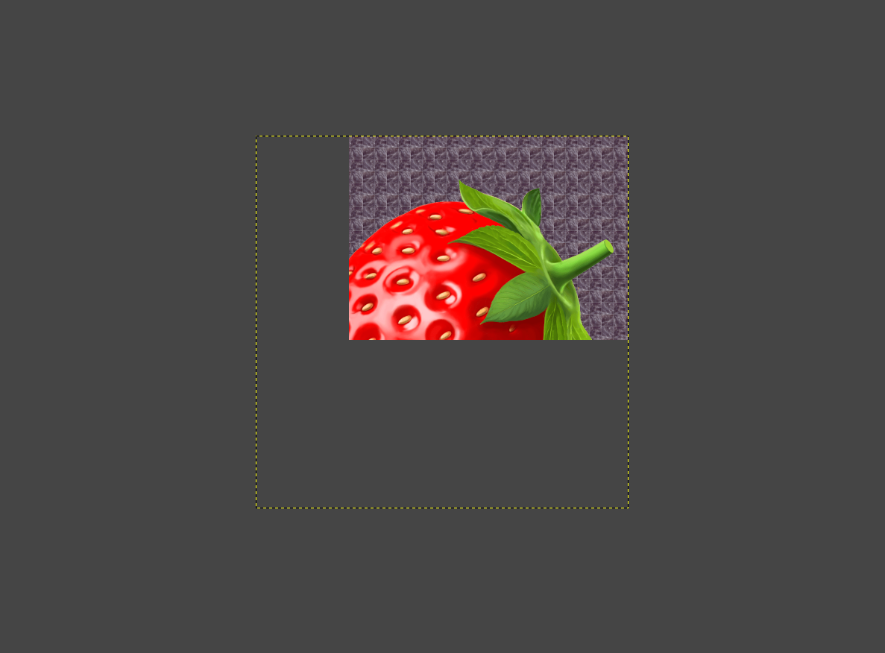

# Using the  *Crop Tool*

*Written by Zachary Harrison*

## 1. Open an Image

1. Go to the `File` menu and select `Open` (Or press `Ctrl` + `O` for Windows and ⌘ `Cmd` + `O` for Mac). 
2. On the pop-up menu, navigate to your file by clicking on one of the folders on the left or by using the **Location** search bar.
    > $\color{lightgreen} \text{Tip:}$ If you want to add a folder to the bar on the left for easy access, first navigate to it using the **Location** search bar. Then click on the `+` in the bottom left, and the name of the folder you've selected will show up at the bottom.

## 2. Select the  *Crop Tool*

Click the icon outlined above if it is the  *Crop Tool*. If it is not, press `Shift` + `C` or hover over its location outlined above and perform its corresponding keyboard actions. 

## 3. Use the  *Crop Tool*

1. Click and drag on any portion of your image.
2. Adjust the alignment boxes in each corner and edge of the image. 
3. Press `Enter` or click on one of the alignment boxes to finish the crop. 

This an example image is before any cropping:
  

| During Crop | After Crop |
|:---:|:---:|
|  |  |

## Troubleshooting

If you're still having trouble, consider searching for your issue on the [GIMP forums](https://www.gimp-forum.net/) or the [GIMP subreddit](https://www.reddit.com/r/GIMP/).