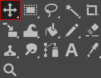
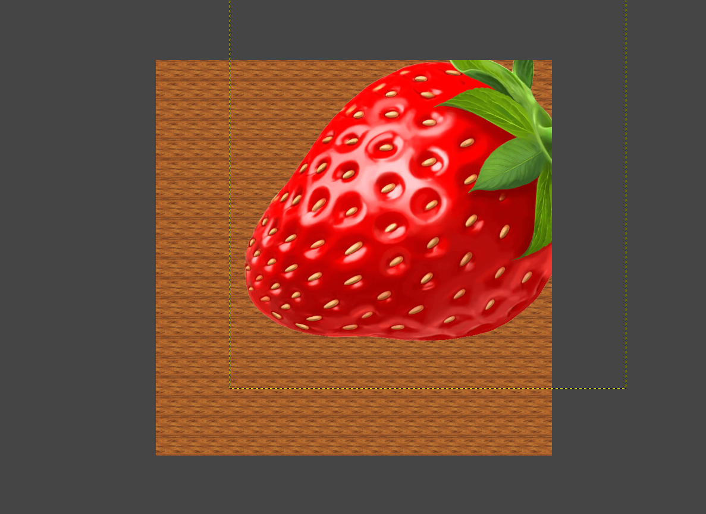
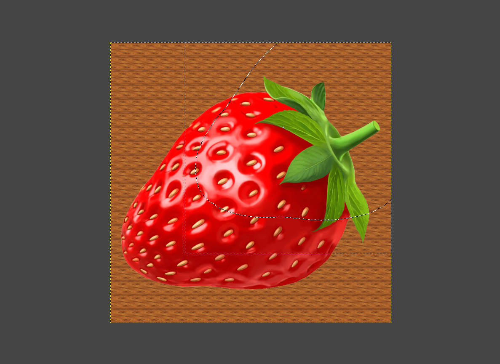

# Using the  *Move Tool*

*Written by Zachary Harrison*

## 1. Open an Image

1. Go to the `File` menu and select `Open` (Or press `Ctrl` + `O` for Windows and ⌘ `Cmd` + `O` for Mac). 
2. On the pop-up menu, navigate to your file by clicking on one of the folders on the left or by using the **Location** search bar.
    > $\color{lightgreen} \text{Tip:}$ If you want to add a folder to the bar on the left for easy access, first navigate to it using the **Location** search bar. Then click on the `+` in the bottom left, and the name of the folder you've selected will show up at the bottom.

## 2. Select the  *Move Tool*

Click the icon outlined above if it is the  *Move Tool*. If it is not, press `M` or hover over its location outlined above and perform the corresponding keyboard actions. 

## 3. Use the  *Move Tool*

You can move a  Layer,  Selection, or  Path. Each transform option can be seen on the left of the below screenshot, outlined in red.
> $\color{lightblue} \text{Note:}$ Because moving a path is relatively rare, I won't cover it here. 

This image is before any moving:
  

> $\color{lightgreen} \text{Note:}$ Click and drag to move an object.

|  **Layer** |  **Selection** |
|:---:|:---:|
|  |  |

What? Nothing happened when we moved the selection! That's because the selection itself was moved, not the pixels it was selecting. As proof, here's what it looks like after coloring in the moved selection:
  
  Previously, if we tried to color in the selection, we would've re-colored the wood-like pattern.
> $\color{lightgreen} \text{Tip:}$ If you want to move the selected pixels, you should cut (`Ctrl` + `X` for Windows or ⌘`Cmd` + `X` for Mac) and paste (`Ctrl` + `V` for Windows or ⌘`Cmd` + `X` for Mac) them.

## Troubleshooting

If you're still having trouble, consider searching for your issue on the [GIMP forums](https://www.gimp-forum.net/) or the [GIMP subreddit](https://www.reddit.com/r/GIMP/).